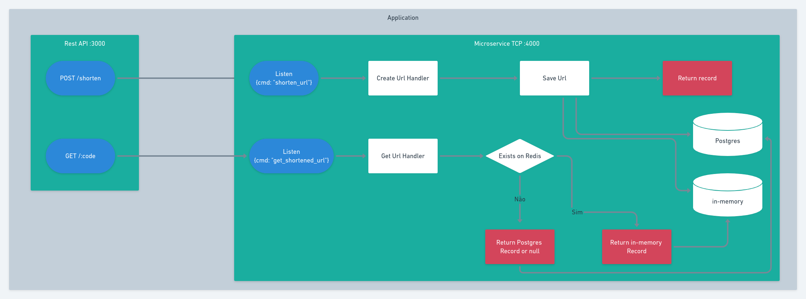

# Encurtador de Url

## Descrição
Projeto em node para encurtar URL e redirecionar para a URL original.
Feito e arquiteturado para rodar em um ecosistema de microserviços.

## Tecnologias
#### Runtime
  * Node 14
  * Express
  * Nestjs
  * Postgres
  * Cache in-memory

## Fluxo
